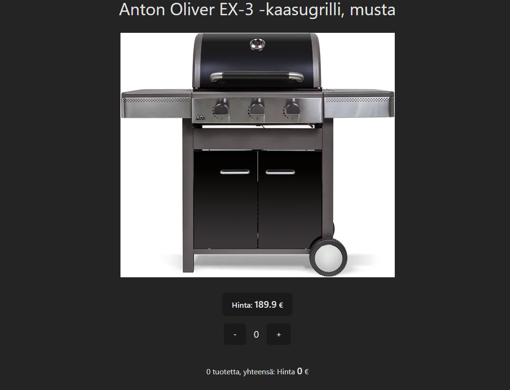

# React useState Training made with React, Vite, Tailwind
Simple online store test with one random product.

Website live:
[https://shopwithelon.vercel.app](https:/shopwithelon.vercel.app)

Key learnings from this small project:
* <b>React State Management:</b> Utilizing useState to manage state within functional components, enabling dynamic user interaction.
* <b>Integration of External Assets:</b> Importing and incorporating external assets like images (Img1) and icons (FaGithub) into React components seamlessly.
* <b>Conditional Rendering:</b> Implementing conditional logic ({count > 0 && ...}) to selectively render components based on state, enhancing user interface responsiveness.
* <b>Responsive Design with Tailwind CSS:</b> Leveraging Tailwind CSS classes (flex, items-center, justify-center) for responsive and visually appealing layout design.
* <b>Accessibility and Best Practices:</b> Ensuring accessibility with semantic HTML (button, footer), proper alt attributes for images, and secure external links (rel="noopener noreferrer").

